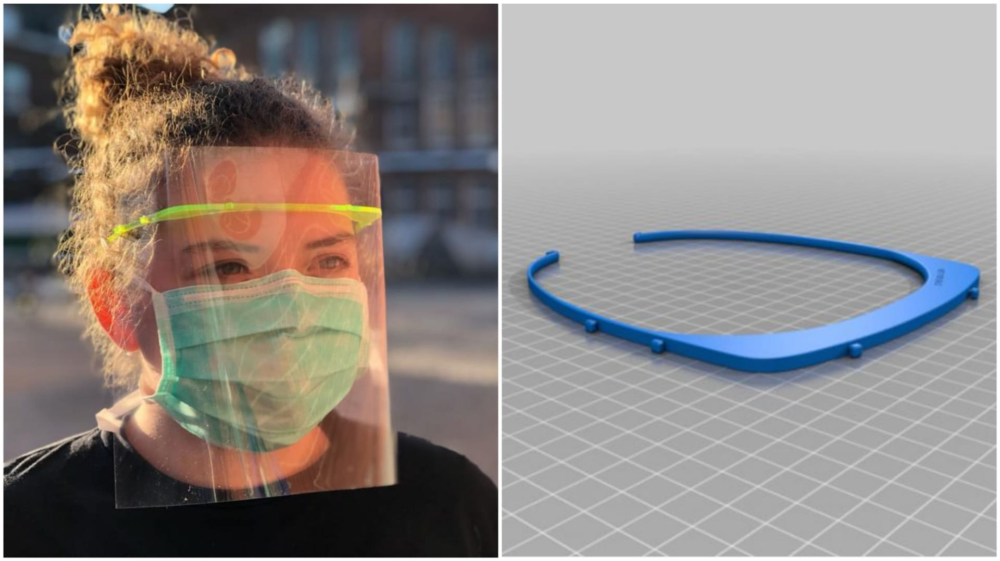
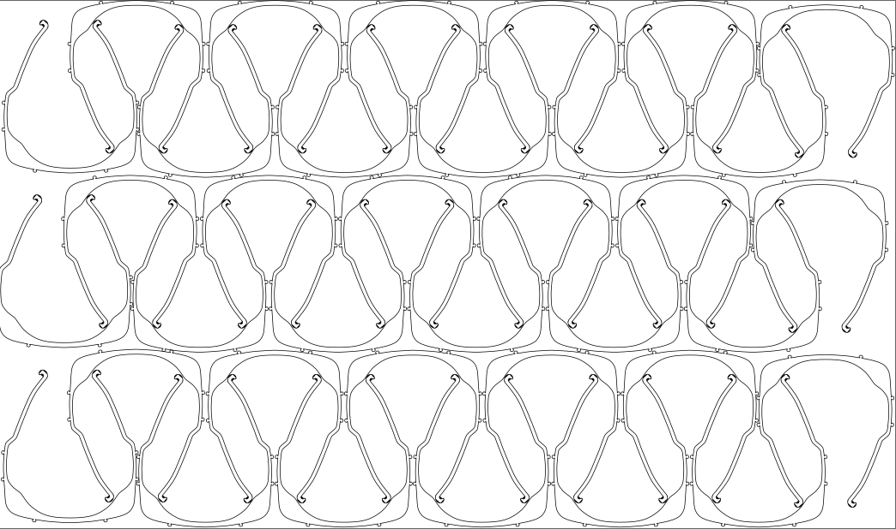

###  - Solution à la découpeuse laser

Nous avons fait valider [ce modèle de chez Thingiverse conçu par LadyLibertyHK](http://thingiverse.com/thing:4159366) par l'hôpital CHU Saint-Pierre à Bruxelles.

#### Matériel

* Matériel
  * plaque de plexiglas en 3 mm
  * feuille A4 transparente
* Outils :
  * découpeuse laser
  * une foreuse + mêche 3.2 mm
* Temps de production : 1 minute par masque

#### Processus de fabrication

##### Etape 1 - Découpe de la structure

Téléchargez les fichiers SVG optimisés pour une plaque 100x60cm ci-dessous et découpez-les à la découpeuse laser.
* [SVG 36 pièces (100x60cm)](./Mask_30pcs.svg)

### Bienvenue dans la #resistancecovid