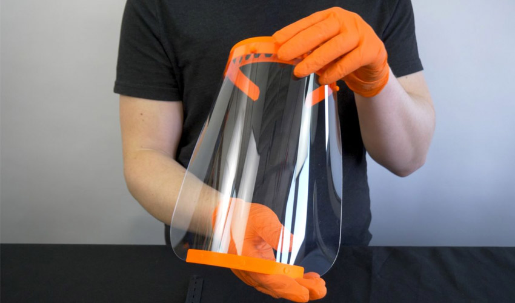
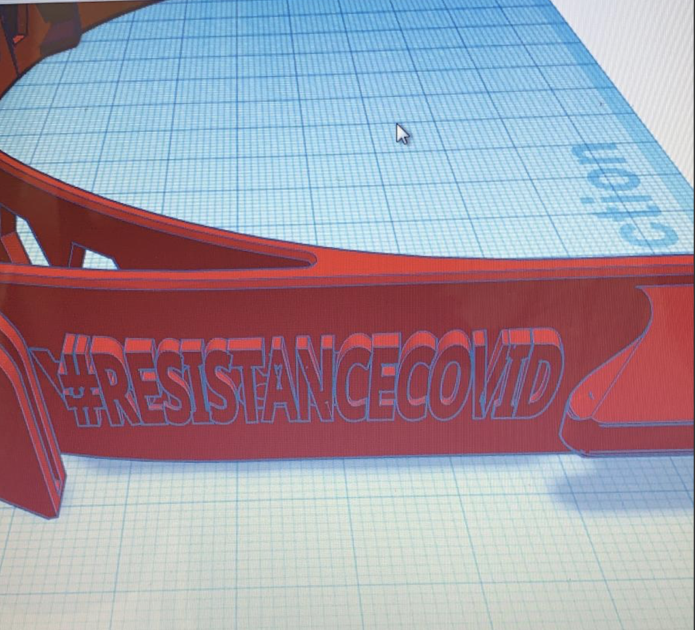
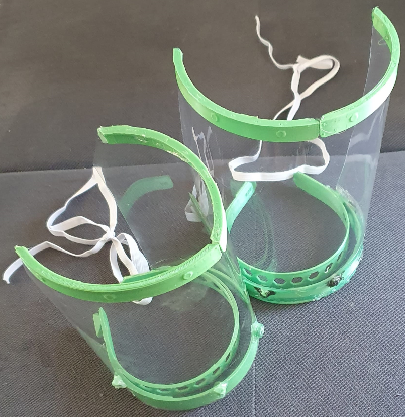

###  - Solution à l'Imprimante 3D

LAST Update 01/04/2020: Sources v9: [Latest](https://github.com/resistancecovid-com/faceshield/raw/master/faceshield_3DPrinting/latest) 

#RESISTANCECOVID RC4 - covid coronavirus Prusa Protective Face Shield - RC1 RC2 RC3 RC3.1 - 
NO ELASTIC  
NO HOLE  
!!!41min!!! 

Nous avons fait valider [ce modèle ](https://www.thingiverse.com/thing:4235970) par l'hôpital CHU Saint-Pierre à Bruxelles.

#### Matériel

* Liste
 * PLA/PLEG
 * A4 Transparent rigide
 * Colle ou pistolet à colle

* Features
 * Optimissation temps d'impression
 * Plusieurs tailles d'impression
 * Multiple Impression
* Temps de production : 41min

Version améliorer des RC1 Prusia Faceshield validé par l'hôpital CHU Saint-Pierre à Bruxelles.

#### Processus de fabrication

##### Etape 1 - Découpe de la structure

[Prusa](https://www.prusaprinters.org/prints/26427-prusa-protective-face-shield-rc1-rc2-remix-rc3-eas/files), nous avons développé une version plus légère et plus rapide à produire vu les contraintes de temps.

Téléchargez l'un de nos modèles 

### Bienvenue dans la #resistancecovid